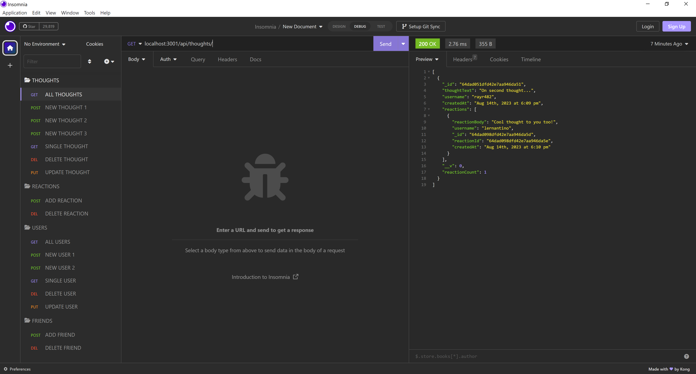

# Social Network API

## Description

This application demonstrates the back-end of a social media network. This application allows users to post thoughts, react to other users' thoughts and make friends with other users! This is important to create because people with the ability to connect online are most likely using social media networks, such as Facebook, Instagram, Twitter, etc., to interact with other people around the world. This application allows users to understand how all of those applications may be working on the back-end.

## Screenshot of Application

## Link to Walkthrough Video

https://drive.google.com/file/d/1ftwDYFa2J3XW5n_CMHMssn7IbcmUM8BG/view
